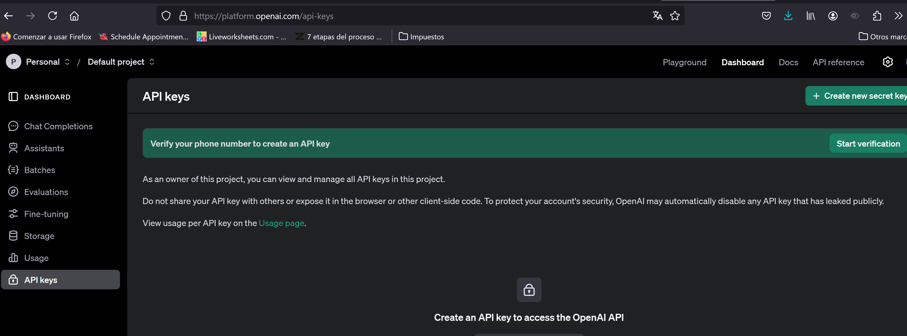
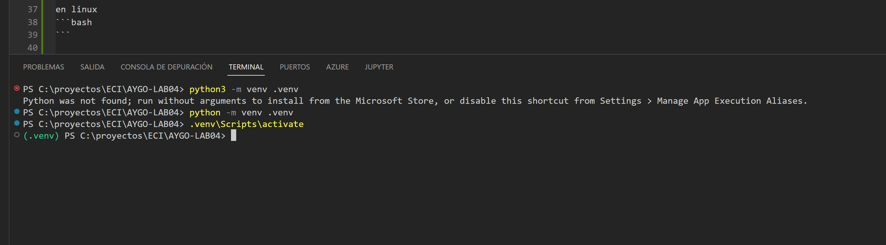
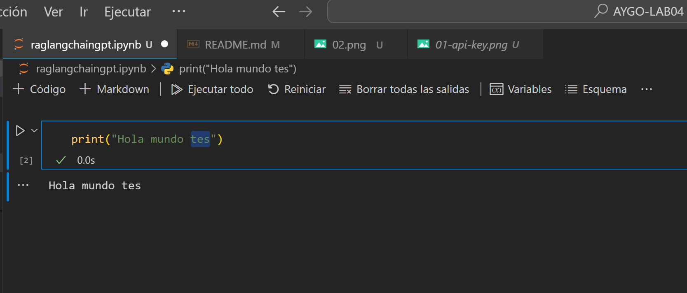
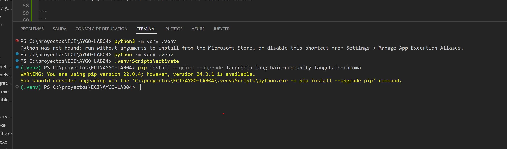

# AYGO-LAB04
Workshop: Building a Retrieval-Augmented Generator (RAG) with LangChain and Pinecone


# Instrucciones

## Parte 1: Construir un RAG usando LangChain y OpenAI

### Configurar el entorno:
1. Instalar las dependencias necesarias: 
    - `langchain`, `openai`, `jupyter` y otras bibliotecas requeridas.
2. Configurar una clave API de OpenAI en tu entorno.

para obtener el api key lo podemos obtener de la siguiente forma:


en nuestra carpeta ejecutaremos el siguiente comando para crear el archivo .env

```bash
python3 -m venv .venv
```
o 

```bash
python -m venv .venv
```

debemos activar mi entorno para no usar el python por defecto de mi computador

en windows
```bash
.venv\Scripts\activate
```

para validar que usaremos nuestro entorno se esta utilizando, veriamos algo similar



hacemos una ejecucion inicial para validar que estamos usando nuestro ambiente



### Crear un Jupyter Notebook:
1. Incluir código paso a paso para integrar LangChain con OpenAI y generar respuestas basadas en una base de conocimiento.
2. Utilizar la [documentación de LangChain sobre LangChain Chat + OpenAI](https://python.langchain.com/) como referencia.

empezaremos instalando las dependencias necesarias para langchain 
```bash
%pip install --quiet --upgrade langchain langchain-community langchain-chroma
```

validamos la instalacin



Podemos crear una pipeline simple y un rag CHAIN con el siguiente comando, especificamente en OpenIA:

```bash
pip install -qU langchain-openai
```

instalamos

```bash
pip install beautifulsoup4
```


3. Explicar la arquitectura:
    - Cómo LangChain procesa las consultas.
    - Cómo recupera información.
    - Cómo genera respuestas.

### Probar el RAG:
1. Usar una base de conocimiento de ejemplo (por ejemplo, un conjunto de documentos o un fragmento de Wikipedia) para realizar pruebas.
2. Demostrar el flujo de trabajo del RAG:
    - Procesamiento de consultas.
    - Recuperación de documentos.
    - Generación de respuestas.

---

## Parte 2: Conectar el RAG a Pinecone

### Configurar Pinecone:
1. Crear una cuenta en Pinecone y configurar una clave API.
2. Inicializar un índice en Pinecone para almacenar y recuperar embeddings de documentos.

### Modificar el Jupyter Notebook:
1. Actualizar el RAG para almacenar y recuperar embeddings vectoriales desde Pinecone:
    - Utilizar la [documentación de integración de LangChain con Pinecone](https://python.langchain.com/docs/integrations/vectorstores/pinecone/).
2. Anotar claramente el código:
    - Explicar los cambios realizados y su propósito.

### Probar con Pinecone:
1. Demostrar cómo las consultas interactúan con Pinecone para la recuperación eficiente de documentos.
2. Comparar y contrastar el rendimiento con la implementación inicial.
```